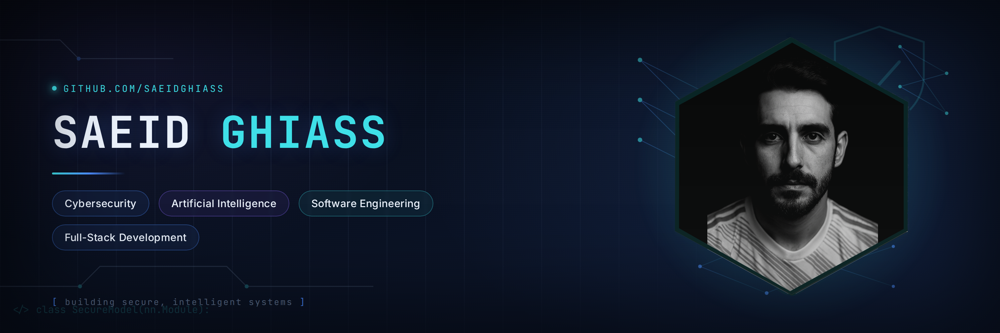

<h1 align="center">Hi 👋, I'm Saeid Ghiass</h1>

<h3 align="center">
Cybersecurity • Artificial Intelligence • Software Engineering • Full-Stack Development
</h3>

Building secure systems, intelligent solutions, and modern web applications.

---

# 👨‍💻 About Me

🎓 Master's Student in Artificial Intelligence

🔐 Interested in Cybersecurity & Secure Software Development

🤖 Machine Learning and Deep Learning Practitioner

👁️ Computer Vision and Image Processing Research

💻 Software Developer

🌐 Full-Stack Web Developer

---

# 🚀 Current Focus

- Cybersecurity
- AI Security
- Machine Learning
- Computer Vision
- Deep Learning
- Full-Stack Development

---

# 💻 Programming Languages

- Python
- C++
- JavaScript
- PHP
- SQL
- HTML/CSS

---

# 🌐 Web Development

---

# 🔐 Cybersecurity

- Secure Software Development

- Web Security

- Network Security

- Penetration Testing

- Linux

- OWASP Top 10

---

# 🤖 Artificial Intelligence

- Machine Learning

- Deep Learning

- Computer Vision

- Neural Networks

- Image Processing

- Data Analysis

# 🛠 Tools

- Git & GitHub
- Linux
- VS Code
- Docker
- PyTorch
- TensorFlow
- OpenCV
- MySQL
---

---

# 📂 Featured Repositories

⭐ Cybersecurity

⭐ Artificial Intelligence

⭐ Computer Vision

⭐ Full-Stack Development

⭐ Python Projects

⭐ Research

---

# 📫 Contact

GitHub

https://github.com/saeid-ghiass

---

# 📊 GitHub Analytics

## 🚀 Featured Projects

| Project | Description |
|----------|-------------|
| 🔐 Cyber Security | Security tools and labs |
| 🤖 Machine Learning | ML projects |
| 👁 Computer Vision | Image Processing |
| 🌐 Full Stack | Web Applications |
| 💻 Python | Python utilities |
| 📚 Research | AI papers |

---

# 🔥 GitHub Streak

---

# 🏆 GitHub Trophies

---

### "Building intelligent systems with security in mind."

---

## 🐍 Contribution Snake

<h2 align="center">

"Secure the Future with Intelligence"

</h2>

